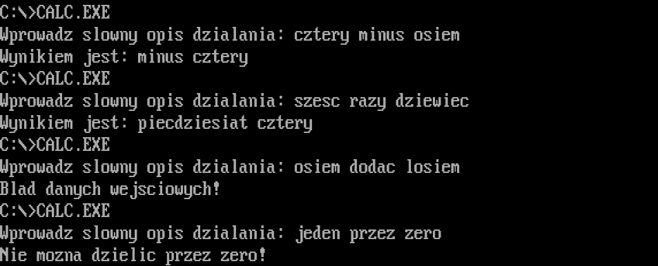
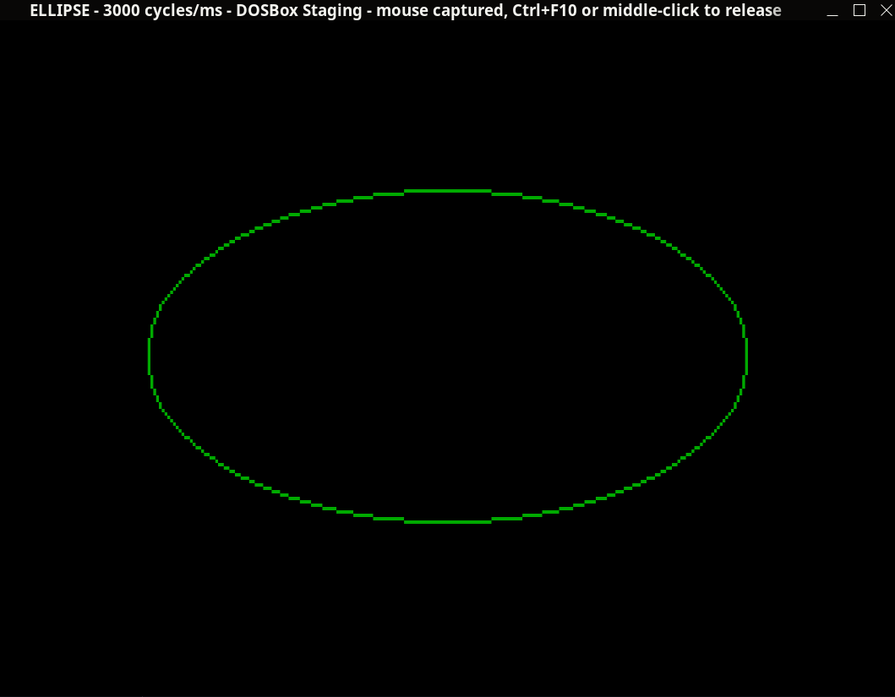
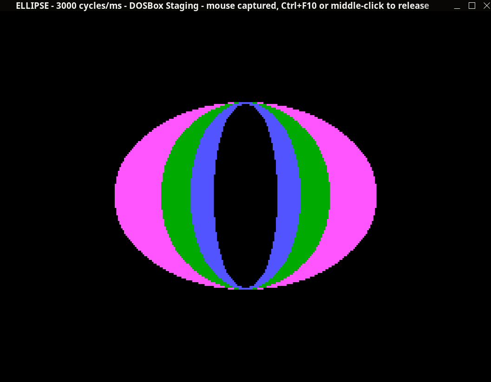

# Assembly course - 2022/23
## Assignments
- ### [Cw01 - Verbal Calculator](assignments/cw01)
    #### Usage example:
    

- ### [Cw02 - Drawing Ellipse](assignments/cw02)
    #### Usage examples:
    
    
## Lecture code
- ### [Here](lectures)
## Turbo Debugger
- ### [TD.exe](helpers/TD.exe)
